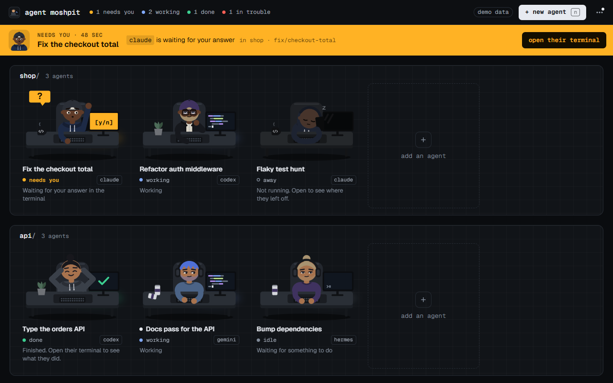
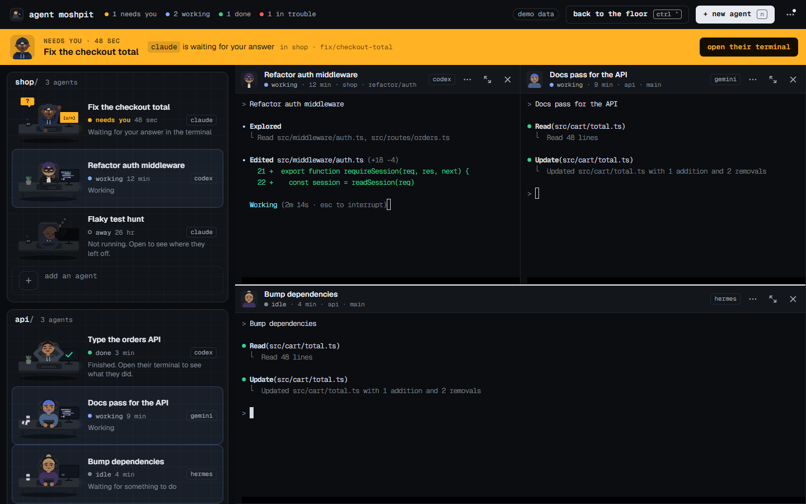
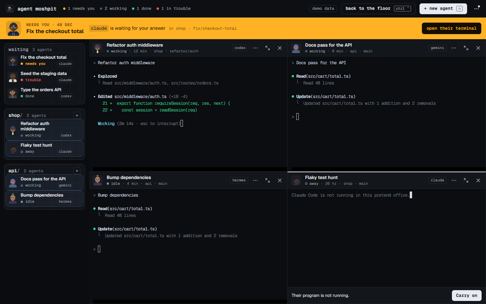
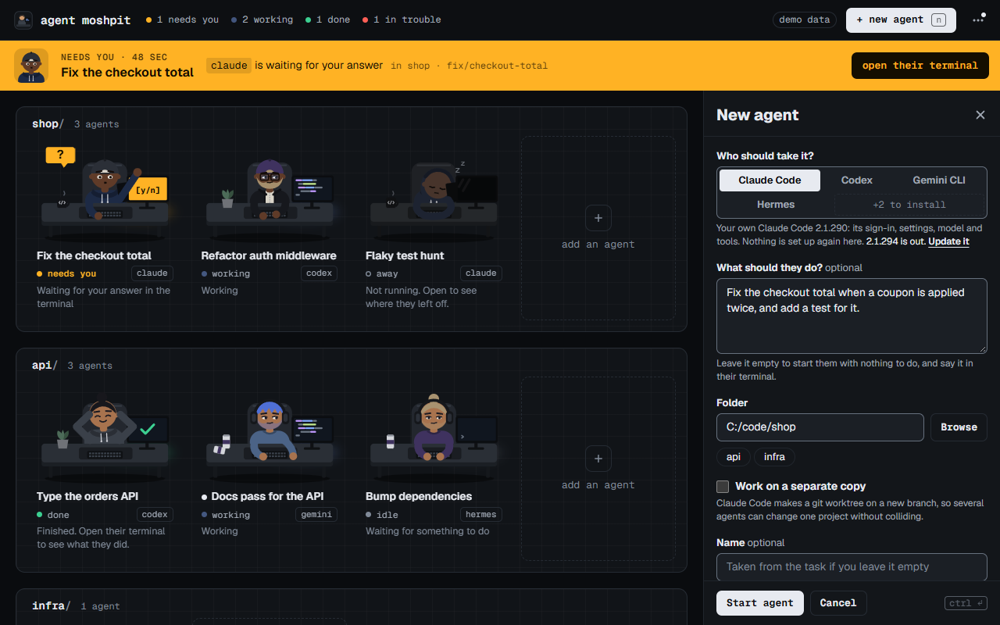

# Agent Moshpit

[](https://github.com/YashIngole/agent-moshpit/actions/workflows/ci.yml)

A small desktop office for coding agents. Each agent you start is a real command-line program (Claude Code, Codex, Gemini CLI, Hermes, or one you add yourself) running in a terminal inside the window, and is drawn as a person at a desk. You see who is working, who has a hand up because they need you, and who is done, and you answer in that agent's own terminal without leaving the window.



| Terminals beside the floor | The floor as a strip | New agent |
| --- | --- | --- |
|  |  |  |

The pictures show the built-in demo data, not a real session. The people and their status are drawn by the app; what is in the terminals is typed by hand to stand in for a program.

## What it is, and what it is not

Agent Moshpit starts the agent programs you already have, each in a pseudo-terminal of its own, as child processes of the app. Everything under a pane's header is that program's own screen: its prompt, its slash commands, its approvals, its settings. The office draws none of it. What the office adds is the floor, where one look tells you the state of every agent and whoever needs you is brought to the top.

- **It runs your own programs with their own sign-ins.** It keeps no account, no API key and no model setting. Whatever `claude` or `codex` does when you type it in a terminal, it does here.
- **It is not a harness.** There is no conversation view, no diff view and no Approve button of the office's own. A question is answered where the program asks it.
- **It sends nothing anywhere itself**, with one exception: unless `MOSHPIT_NO_UPDATE_CHECK` is set, it asks npm (`npm view <package> version`) for the newest version of each installed program that is published there, when it starts and every 12 hours. There is no telemetry and no remote font or script. The programs it starts talk to their own services as they always do. An install or an update runs only when you press its button, in a terminal where you see every line.
- **Nothing is a separate window.** There is one Agent Moshpit button in the taskbar. Each program is a process of its own under the app, and is ended when the app quits.
- **It shows the agents you start from it.** A session you started in another terminal, or in a desktop app, does not appear.
- **A link in a terminal opens in your browser**, and only if it is an `https` address or an `http` one on this computer. The window itself cannot be sent anywhere. A file path is only ever handed to your editor: nothing a program prints is run.
- It is not affiliated with Anthropic, OpenAI, Google, Nous Research or the makers of any other program it can run, nor with Gather.

## Status

Version 0.2.0. It is used every day, and tested by hand, on Windows 11 only. macOS and Linux are built and put through the same automated checks by CI on every change (the badge above), and **nobody has used those builds by hand yet**. If you do, please [say what breaks](https://github.com/YashIngole/agent-moshpit/issues).

Installers for Windows, macOS (Apple Silicon and Intel) and Linux (`.AppImage`, `.deb`, `.rpm`) are attached to each [release](https://github.com/YashIngole/agent-moshpit/releases). They are not signed with a bought certificate, so Windows and macOS ask the first time; the release notes say what to click.

A few things exist on Windows only for now: notifications that open a desk when clicked, turning off the webview's browser keys (so F5 does not reload the window), and letting the right-click Paste read the clipboard without a prompt.

The first Agent Moshpit was a different app, a client for Hermes that drew conversations itself. It was never published. `docs/plan-cli-office.md` is the plan that replaced it; it was written before the work began, so where it and this file differ, this file is right.

## Requirements

- Windows 11 is where it is used. The macOS (10.15 or later) and Linux (WebKitGTK 4.1) builds are made and checked by CI and have not been used by hand. Windows 10 with WebView2 should work and has not been tried.
- At least one agent program, installed and signed in the way its makers say. The office looks for each one on your `PATH` and in the usual install folders, and can install the ones published on npm for you.
- Node.js with npm, for building, and for the office to install and update programs and to see when a newer version is out.

To build you need Node 22 (22.12 or later) or Node 24, Rust 1.89 or later, and the [Tauri prerequisites](https://tauri.app/start/prerequisites/) for your system.

## Build and run

```sh
npm install
npm run tauri dev                              # run from source
npm run tauri build                            # make an installer for the system you are on
npm run tauri build -- --debug --no-bundle     # only the program, with debugging on: what the app tests drive
```

The last one leaves `agent-moshpit.exe` in `src-tauri/target/debug`, or in `debug` under your cargo target folder if you have set one. The installers are not signed, so Windows and macOS will warn the first time. The macOS app is signed ad hoc, with no certificate, which is what lets it open at all on Apple Silicon.

A release is made by pushing a tag: `.github/workflows/release.yml` builds the installers for the three systems and attaches them to a draft release, which a person reads and publishes.

Start the app with `--hidden` to go straight to the tray, for example from a start-up entry.

To look at the window without any program behind it, run `npm run dev` and open `http://localhost:1420/?demo=office` in a browser. The scenes are `office`, `calm`, `empty` and `crowd`. Add `&still` to stop anything changing by itself, `&problem` to see a broken `harnesses.json` reported, `&noeditor` for a computer with no editor, and `&open=demo-4` for a click on a notification about that desk.

## Using it

### Start an agent

Press **+ new agent** (`n` on the floor, `Ctrl+Shift+N` anywhere, or **New agent…** in the tray menu). An empty desk in a room, or the **+** on a room's sign, opens the same form on that room's folder.

- **Who should take it?** The programs found on this computer. Ones the office can install sit behind **+N to install**. Choosing one shows the exact command, and the button becomes **Install … and start**: the install runs in a pane where you can watch it, and the agent then starts in that pane.
- **What should they do?** Optional, and offered only for programs that take a task as they start (Claude Code, Codex, Gemini CLI). Leave it empty and say it in their terminal. Hermes, and the programs the office knows only by name, start in the folder and wait for you there.
- **Folder.** Type it, browse for it, or pick one used before.
- **Work on a separate copy**, where the program can (Claude Code, Codex, Hermes). The program is asked to make a git worktree of its own (`--worktree`), so several agents can change one project without colliding.
- **Name.** Optional. Left empty it is the start of the task, or the program and folder: "Claude in web", then "Claude in web 2".

`Ctrl+Enter` starts the agent from anywhere in the form. Closing the form keeps what you typed in it. The program and the separate-copy box are remembered for the next agent, because people start several alike.

The new agent walks to a desk in the room of their project, and their terminal opens in a pane of its own.

### The floor

One room per project (the git repository's name, or the folder's), a desk per agent. A desk shows the person, a name, a status with how long it has lasted, a tag saying which program it is, and one line about what is going on.

| Status | How they look | What it means |
| --- | --- | --- |
| Starting | sitting, three dots on the screen | The program has been started and has not settled yet. |
| Working | typing, code on the screen | It is at work. |
| Needs you | a hand up, an amber tag, an amber screen | It has stopped on a question only you can answer, in its terminal. |
| Done | leaning back, a green tick on the screen | It finished a stretch of work that you have not looked at yet. |
| Idle | sitting at a prompt | Running, with nothing to do. |
| Trouble | hands on their head, a red tag, a red screen | The program could not be started, or stopped with an error as soon as it started. |
| Away | asleep, the screen dark | Not running. The desk shows where they left off and offers to start them again. |

A status is always a word and a pose as well as a colour. Four colours carry meaning and are used for nothing else: amber for needs you, green for done, red for trouble, and blue for the light of a screen at work.

- A small dot before a name means their terminal has printed something since you last had it in front of you.
- The counts in the top bar (`1 needs you`, `2 working`, `1 done`, `1 in trouble`) are buttons: a click shows the next desk in that state.
- With more than ten agents and no terminals open, desks are drawn smaller so a crowd fits.
- The floor is one stop for `Tab`. The arrow keys walk from desk to desk and `Enter` opens one.

### Terminals

Click a desk and their terminal opens to the right of the floor, with the keyboard in it. A click on another desk shows that one in the same pane. Hold `Ctrl` as you click, or press `Ctrl+Enter` on a desk, to open it beside the others instead: two sit side by side, more make a grid, as many as you like.

- **Each pane is headed by its agent**: face, name, status, project and branch, and program.
- **The grid stays as you made it.** A new pane goes beside its neighbour, and a closed one gives its room to a neighbour; nothing else moves. Drag any edge between two panes, or double-click one to make them all even. Drag a pane by its header onto another to swap the two.
- **Give one pane the room** with `Ctrl+Shift+Enter`, the button in its header, or a double-click on the header. A **+N** chip lists the ones waiting behind it and puts them back.
- **Put a pane away** with its × or `Ctrl+Shift+W`. The program keeps running at its desk.
- **Back to the floor, and back again,** with `Ctrl` + `` ` ``. The same panes return. Pick a desk while you are on the floor and they return with that desk among them. `Esc` is not used for this, because the programs use it themselves.
- **The floor beside the terminals** keeps the width you drag it to. Below 300 pixels it becomes a strip: a list of names, each with its status and program, with whoever needs you, is in trouble or is done gathered on top under **waiting**. Double-click that edge to switch between the strip and the usual width.
- In a window narrower than 760 pixels the terminals take the whole window and the floor waits behind them.

### In a terminal

Whatever you type goes to the program, apart from the office's own keys, which are listed under [Keys](#keys).

- **Copy.** `Ctrl+C` copies when text is selected; with nothing selected it goes to the program. **⋯ → Copy on select** copies as soon as you select.
- **Paste.** `Ctrl+V`, or right-click and **Paste**.
- **A picture on the clipboard.** `Ctrl+V` saves it as a file under `pasted/` in the data folder and pastes that file's path, so the program is given the picture as a file.
- **Files dropped on a pane.** Their paths are pasted into that pane, in quotes where a path has a space. The pane lights up before you let go.
- **A file path** such as `src/app.ts:42`. `Ctrl` and a click opens it in your editor at that line. The office looks for Cursor, VS Code, Windsurf, Antigravity and Zed and uses the first it finds, until you choose one under **⋯ → Agent programs → Files open in**. With none of them here, the file is shown in its folder.
- **A web address.** A click opens it in your browser.
- **Find** in what a terminal has shown with `Ctrl+Shift+F`.
- **Text size.** `Ctrl+=`, `Ctrl+-` and `Ctrl+0`, or `Ctrl` and the mouse wheel. It is remembered.
- **Right-click** for Copy, Paste, Select all, Find and Clear the scrollback, followed by everything in the desk's own menu.

Each terminal keeps 5,000 lines of scrollback, and the core keeps the last half megabyte each program printed, so a pane that was put away, or a window that was closed, comes back showing the screen as it stands.

### When someone needs you

Amber means one thing here: someone needs you.

- Their hand goes up at their desk, with a line saying what for when the office knows.
- A band across the top names whoever has waited longest and has one button, **Open their terminal**, which opens it beside whatever is already open. Anyone else waiting is listed on the band. The band is only there for people whose terminal is not already in front of you.
- The top bar counts them, the window's title becomes `Agent Moshpit (2 need you)`, the taskbar button flashes if the window is behind, and the tray icon changes.
- You get a notification, unless you are looking at that terminal.

The hand stays up until the question is answered in their terminal. Going back to the floor, or opening another pane, does not lower it.

How the office knows, without ever reading the words on a program's screen:

- **Claude Code says so itself.** It keeps a small file about each running session (`~/.claude/sessions/<pid>.json`), and the office reads from it whether Claude is busy, idle or waiting.
- **Every other program is read from how its terminal behaves.** One that keeps printing is working. One that goes quiet is idle, or done if it had been working. One that rings the terminal's bell or sends a terminal notice wants you, or has finished if the notice says so. Codex is started with its terminal notices turned on for this.
- **A folder nobody has trusted yet.** Claude Code and Codex first ask whether to trust a folder they have not been told about. The office reads their own settings before starting one, and shows **needs you**, "Asks whether to trust this folder", until you press a key in that terminal.
- **A task that stops at once.** A program handed a task that goes quiet almost immediately, before anyone has typed, shows **needs you**, "Asked something before starting".

A green tick means they finished something you have not seen. Bring their terminal in front of you and it comes down.

### Notifications

The office tells you when an agent needs you, is done, or hit a problem, unless that agent's terminal is already in front of you. On Windows a click on the notification opens the office with that desk's terminal beside the others, and starts the office first if it had quit; a newer notification about a desk takes the place of the older one.

### A desk's menu: rename, restart, stop, remove

Right-click a desk on the floor, in the strip or on a pane's header, press `Shift+F10` on it, or use the ⋯ on its pane.

- **Open their terminal**, or **Open beside the others**.
- **Start another like this.** The New agent form, on the same program and folder.
- **Rename** (`F2`). An emptied name goes back to the one the desk was given. Claude Code's own name for a session is used until you name the desk yourself.
- **Restart their program** and **Stop their program.** Stop ends the program and keeps the desk, away. Both ask first if the agent is working, starting or waiting for you, and the menu says whether the conversation will be carried on or started afresh.
- **Carry on** or **Start again**, for a desk whose program is not running.
- **Open the folder in** your editor, **Show their folder**, **Copy the folder path**.
- **Remove this desk.** Also the × that appears on a desk under the pointer, a middle-click, or `Delete`. The desk leaves the floor at once and can be brought back with **Undo** for eight seconds; after that its program is ended and the desk is gone. If the agent is busy you are asked first. The program keeps the conversation in its own history, and nothing of yours is deleted: the folder, and a worktree a program made for a separate copy, are left as they are.

### Closing the window, and quitting

Closing the window does not quit. The window goes and the office stays in the tray: agents keep working, the tray icon shows when someone needs you, and notifications still arrive. The first time, a notification says so. Click the tray icon, or start the app again, and the window comes back with the panes it had.

- **To quit**, use **Quit Agent Moshpit** in the tray menu or the ⋯ menu, or press `Ctrl+Shift+Q` (`Ctrl+Q` works too when the keyboard is not in a terminal). Quitting ends every agent's program. If anyone is busy you are asked first, and told who will carry on later and who will start afresh.
- **⋯ → Closing the window quits** makes the window's × quit instead, asking first if anyone is busy. It is off by default.
- On a desktop with no tray, closing the window quits.

### What comes back after a restart

- Every desk is back, away. Nothing is started until you ask.
- Opening a desk shows its last screen as it was drawn when the office quit, with up to 500 lines above it, and a **Carry on** or **Start again** button.
- **Carry on** resumes the conversation where the program can: Claude Code, Codex once the office has read which session it began, and Hermes. The others start afresh in the same folder.
- The window has the size and place it had, the same floor width and text size, and `Ctrl` + `` ` `` brings back the panes that were open.

What does not come back is a terminal's scrollback beyond that last screen.

### The ⋯ menu

- **Agent programs.** Every program the office knows, with its version, whether a newer one is out, and a button to install or update it. The command that will run is written beside the button, and it runs in a pane. This panel also chooses the editor that file paths open in.
- **Make the terminals even**, when more than one is open.
- **Copy on select**, off by default.
- **Closing the window quits**, off by default.
- **Keys.** Every shortcut in one list.
- **Quit Agent Moshpit.**

### Keys

| | |
| --- | --- |
| **Anywhere** | |
| `Ctrl` + `` ` `` | Back to the floor, and back to the terminals |
| `Ctrl+Shift+N` | New agent (`n` on the floor) |
| `Ctrl+Shift+Q` | Quit, asking first if anyone is busy |
| `Ctrl+Q` | The same, when the keyboard is not in a terminal (there it is the program's) |
| `Ctrl+Shift+/` | The list of keys (`?` on the floor) |
| `Esc` | Close a side panel or a menu, when the keyboard is not in a terminal |
| **Terminals** | |
| `Alt+1` … `Alt+9` | The keyboard to pane 1 to 9 |
| `Ctrl+Shift+]` / `Ctrl+Shift+[` | The keyboard to the next pane, or the one before |
| `Ctrl+Shift+Enter` | Give this pane the room, and put the others back |
| `Ctrl+Shift+W` | Put this pane away; its program keeps running |
| `Ctrl+Shift+F` | Find in what this terminal has shown |
| `Ctrl+=` / `Ctrl+-` / `Ctrl+0` | Bigger text, smaller, the usual size |
| `Ctrl+C` | Copy, when text is selected; otherwise the program's |
| `Ctrl+V` | Paste. A picture is pasted as the path of a file holding it |
| `Shift+Enter` | A new line in the program's prompt |
| `Shift+Tab` | The program's (Claude Code's mode switch); the keyboard stays in the terminal |
| **On the floor** | |
| Arrow keys | From desk to desk |
| `Enter` | Open their terminal |
| `Ctrl+Enter` | Open it beside the others |
| `F2` | Rename |
| `Delete` | Take the desk away (it can be brought back for a moment) |
| `Shift+F10` | The desk's menu |
| **With the mouse** | |
| `Ctrl` and a click | Open a desk beside the others |
| `Ctrl` and a click on a file path | Open it in your editor, at its line |
| `Ctrl` and the wheel | Bigger or smaller text, over a terminal |
| Right-click | A desk's menu, or a terminal's |
| Middle-click | Take a desk away |
| Drag a pane's header | Onto another pane, to change places |
| Double-click a pane's header | Give it the room |
| Drop files on a pane | Their paths are pasted into it |

## The programs it knows

The office knows very little about each program, on purpose: what it is called, what to type to start it, and how to hand it a task. Everything else is the program's own business and is seen through its terminal.

| Program | Started as | Takes a task as it starts | Carries on after a stop | Separate copy | Installed and updated by the office |
| --- | --- | --- | --- | --- | --- |
| Claude Code | `claude` | yes | yes (`--resume`) | yes | npm `@anthropic-ai/claude-code`; `claude update` |
| Codex | `codex` | yes | yes (`codex resume`), once its session is known | yes | npm `@openai/codex`; `codex update` |
| Gemini CLI | `gemini` | yes (`--prompt-interactive`) | no | no | npm `@google/gemini-cli` |
| Hermes | `hermes` | no | yes (`--continue`: its latest conversation, whichever desk that was) | yes | not installed by the office; `hermes update` |
| OpenCode, Copilot CLI, Amp, Qwen Code, Crush | `opencode`, `copilot`, `amp`, `qwen`, `crush` | no | no | no | npm (`opencode-ai`, `@github/copilot`, `@sourcegraph/amp`, `@qwen-code/qwen-code`, `@charmland/crush`) |
| Cursor CLI, Aider, Goose, Droid | `cursor-agent`, `aider`, `goose`, `droid` | no | no | no | no: install them their own way and they are offered |

The first four rows were written from each program's own `--help` on 8 October 2026 (Claude Code 2.1.290, Codex 0.160.0, Gemini CLI 0.2.1, Hermes 0.21.2). The rest are known by name only: they start in their folder and you type the task in their terminal, which is right for any program whatever its flags are.

### Adding a program of your own: `harnesses.json`

Put a file called `harnesses.json` in the data folder (see [Where things are kept](#where-things-are-kept)). It is a JSON list of rows. A row whose `id` is one the office already knows replaces that program; any other row is added at the end. The file is read when the office starts.

```json
[
  {
    "id": "mine",
    "name": "My Agent",
    "tag": "Mine",
    "program": "C:\\Tools\\my-agent.exe",
    "task": { "flag": "--ask" },
    "resume": ["--again"]
  }
]
```

| Field | Needed | What it is |
| --- | --- | --- |
| `id` | yes | Letters, digits, `-` and `_`. |
| `name` | yes | The full name: "Claude Code". |
| `tag` | yes | The short word on a desk: "Claude". |
| `program` | yes | What is typed to start it: a plain name found on the `PATH`, or a full path. Never a line for a shell. |
| `args` | | Words passed every time, before anything else. |
| `task` | | How the first task is handed over: `"last"` (as the last word), `{ "flag": "--ask" }` (after that flag), or `"none"` (typed in the terminal; the default). |
| `resume` | | Words that make it carry on an earlier conversation. `{session}` stands for the conversation's id. Empty: it starts afresh. |
| `session` | | How the office learns that id: `"given"` (the office picks one and passes it after `session_arg`), `"codex_rollouts"` (read from the files Codex writes), or `"unknown"` (the default). |
| `session_arg` | | The flag that sets a new conversation's id, when `session` is `"given"`. |
| `name_arg` | | The flag that names a conversation, if the program has one. |
| `worktree` | | Words that make it work on a git worktree of its own. With these the form offers **Work on a separate copy**. |
| `status` | | Where its status is read from: `"activity"` (how its terminal behaves; the default) or `"claude_sessions"` (Claude Code's own session files). |
| `trust` | | Whether it first asks to trust a folder, and where that is kept: `"claude"`, `"codex"`, or `"none"` (the default). |
| `package` | | Its package on npm, which installs it, updates it when it has no way of its own, and says which version is the newest. |
| `update` | | Words that make the program update itself. |
| `install` | | A command that installs it, program first, for something npm does not install. |

A file that cannot be read, or a row that cannot be used, is reported in a strip at the top of the window when the office starts, with a button that opens the file, at the line when the mistake has one. In JSON a `\` in a Windows path is written `\\`.

A desk whose program is not in the table when the office starts is not shown, but it is kept: it stays in `desks.json`, at its place in the list, and its last screen stays in `screens/`. So if `harnesses.json` is reported as unreadable and your desks for the programs in it are missing from the floor, nothing is lost. Fix the file and start the office again, and they are back where they sat.

The same holds for a row you take out or give another `id` on purpose: its desks are out of sight, not gone, and there is nothing in the window yet that removes them. To be rid of one, put the row back for one start and use **Remove this desk**, or quit the office and delete its entry from `desks.json`.

## Settings from outside

| Variable | What it does |
| --- | --- |
| `MOSHPIT_NO_UPDATE_CHECK` | Set to anything, the office never asks npm for newer versions. |
| `MOSHPIT_DATA_DIR` | Keep the office's files in this folder instead of the app's data folder. |
| `MOSHPIT_INSTANCE` | A name (letters and digits) that makes this a separate office next to the one already open: its own window, data folder, window title ("Agent Moshpit (name)") and notification address. `--instance name` on the command line does the same. Used by the tests. |
| `MOSHPIT_DEVTOOLS` | Set to anything, the webview's browser keys are left on (F5 reloads the window; in a debug build F12 opens the developer tools), for working on the window itself. Windows. |
| `MOSHPIT_APP` | Read by the app tests only: the path of the program to test. |

The office also reads `CLAUDE_CONFIG_DIR` and `CODEX_HOME`, the programs' own variables, to find where each keeps the folders it trusts.

On the command line: `--hidden` starts in the tray with no window, and `--instance name` is described above.

## Where things are kept

The data folder is `%APPDATA%\io.github.yashingole.agentmoshpit` on Windows, `~/Library/Application Support/io.github.yashingole.agentmoshpit` on macOS and `~/.local/share/io.github.yashingole.agentmoshpit` on Linux, unless `MOSHPIT_DATA_DIR` says otherwise.

| File | What is in it |
| --- | --- |
| `desks.json` | The desks: which program, the name, the folder, and the id of the conversation when it is known. |
| `window.json` | The window's size and place. |
| `settings.json` | Whether closing the window quits. Written the first time you change it. |
| `screens/` | Each desk's last screen, written when the office quits. |
| `pasted/` | Pictures pasted into terminals. Cleared after a week. |
| `harnesses.json` | Your own programs, if you wrote any. |
| `told-about-tray` | An empty marker, so the notice about the tray is given only once. |

The layout of the panes, the floor's width, the text size, the editor you chose, copy on select and the folders used before are kept by the window itself, in the webview's storage (on Windows under `%LOCALAPPDATA%\io.github.yashingole.agentmoshpit`).

Conversations are not kept by the office. Each program keeps its own history where it always does.

On Windows the office also writes one entry under `HKEY_CURRENT_USER\Software\Classes\agent-moshpit` each time it starts. That is what lets a clicked notification open a desk: the notification opens an `agent-moshpit://desk/…` address, and Windows hands it to the app.

## How it is put together

```
src-tauri/src/   the core, in Rust
  lib.rs           the window, the tray, notifications, settings, and the commands the window may call
  engine.rs        owns the desks and the terminals, starts programs, looks at them twice a second
  office.rs        the state of every desk, as a pure function of what was seen at it
  status.rs        working, idle or waiting: from Claude Code's own files, or from how a terminal behaves
  harness.rs       the table of programs, harnesses.json, and finding, installing and updating them
  pty.rs           a pseudo-terminal for each program, and the screens kept for a window opened later
  proctree.rs      making sure every program dies with the app (a job object on Windows)
  editor.rs        the editor a file path is opened in
  link.rs          the agent-moshpit:// address that opens a desk
  toast.rs         Windows notifications that can be clicked
  model.rs         what the window is told about the office: plain data
src/             the window, in Svelte 5
  App.svelte       the frame, the office's own keys, dropped files
  components/      the floor, a desk, a person, the amber band, the top bar and its menu,
                   the panes and a terminal, the New agent, Agent programs and Keys panels
  lib/             the bridge to the core, the window's state, the layout of panes, the menus,
                   file paths and links, words, looks, the shared beat, demo data
  styles/          the colours, type and spacing (tokens.css)
tools/e2e/       the tests that drive the window and the real app, and the stand-in programs they use
site/            agentmoshpit.com: one static page. `npm run build:site` builds the window with its demo
                 data into site/demo, which the page shows live; `node tools/site-shots.mjs` takes its pictures
docs/            the plan for this version, its mockups, and two reviews with their screenshots
spikes/          the proof that programs run inside one app with no window of their own
```

The core holds all state. The window is disposable: closing it destroys the webview, and a new one is drawn from a snapshot and from what each terminal last showed. The terminals are drawn with xterm.js. The programs are children of the app, tied to it so that none is left behind.

The look is dark, the office after hours: graphite rooms, matte desks, and the only bright things are screens and the amber that means "needs you". Type is Geist and Geist Mono, bundled with the app. The colours, type and spacing are in `src/styles/tokens.css`. `DESIGN.md` describes the look as built: what each colour means, the type, the layout and every component. `node tools/make-design-json.mjs` makes `.impeccable/design.json` from it, and stops if it and the stylesheet disagree. `PRODUCT.md` says who this is for and why.

## Tests

```sh
cd src-tauri && cargo test     # the core: desks, status, the program table, terminals
npm test                       # the window's layout of panes, file paths, links, words, looks and times
npm run check                  # the window's types
npm run test:ui                # builds the window and drives it in a headless Edge or Chrome, with demo data
```

One test drives the real app on Windows through WebView2's debugging port. Build the debug program first:

```sh
npm run tauri build -- --debug --no-bundle
node tools/e2e/terminals.mjs
```

`npm run test:app` runs the same test. It looks for `agent-moshpit.exe` in `src-tauri/target/debug`, or under `CARGO_TARGET_DIR` when that is set. If yours was built somewhere else, set `MOSHPIT_APP` to its full path. The agents in this test are stand-in programs added through `harnesses.json`, so no Claude Code, no Codex and no model is used and nothing is spent. It opens the app's window on your desktop while it runs, as the office named `e2e`, and reads the clipboard once without changing it.

`node tools/e2e/real-clis.mjs` starts the real Claude Code and Codex with no task and types nothing into them, to check what only the real programs can show: the question about trusting a folder, and Codex staying idle while its pane is resized. A program that is not installed is skipped.

Every test of the real app runs it as its own named office with its own data folder (`MOSHPIT_INSTANCE`, `MOSHPIT_DATA_DIR`), so an office you have open is left alone, and none of them asks npm for versions.

## Known limits

- Not used by hand on macOS or Linux. CI builds both and runs the automated checks there, and that is all that is known about them.
- A desk says that an agent is working, not on what. The programs do not say.
- Status read from a terminal's behaviour is a reading, not a report. A program that asks a question without ringing its terminal looks idle or done. Answering a raised hand while the window is behind other windows can show "done" for a moment.
- Sessions started outside the office are not shown and cannot be brought in.
- A real click on a real Windows notification has not been tried by hand, nor has the taskbar flash been seen. What was checked is that the notification carries the desk's address, and that opening that address opens the desk in the running office.
- Whether Claude Code and Codex take a pasted picture's path as the picture has not been checked with the real programs.
- **Work on a separate copy** has not been run end to end. The office passes the program its own flag; the worktree is the program's doing.
- Installing a real package with npm from inside the app has not been run; a stand-in installer was.
- Claude Code's status has not been watched through real work in a test, because that means giving it a real task.
- Programs known only by name, and Gemini CLI, always start afresh. Codex carries on only after the office has read which session it began.
- A desk's last screen is written when the office quits, not while it runs, so after a crash an away desk shows an older screen or none.
- On Windows, a program that can only be started through `cmd.exe` cannot be handed a task containing characters `cmd.exe` would read as commands. The office says so and asks you to type the task in the terminal.
- Updating a program while agents are running it can fail on Windows until they stop.
- The tray icon and its menu are not covered by any automated test.
- One window, no sounds.
- Installers are not signed with a certificate (the macOS app is signed ad hoc only), so Windows and macOS warn the first time. The app has no updater of its own.

## Licence

MIT. See `LICENSE`. Geist and Geist Mono are bundled under the SIL Open Font Licence.
