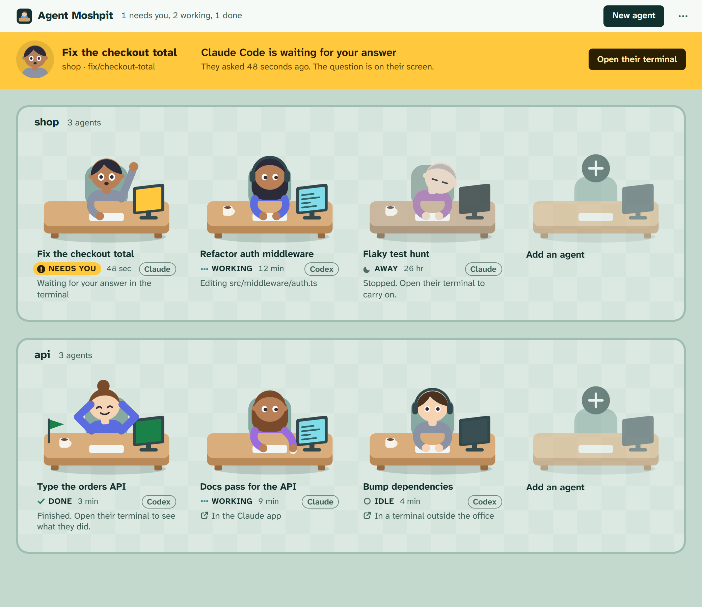
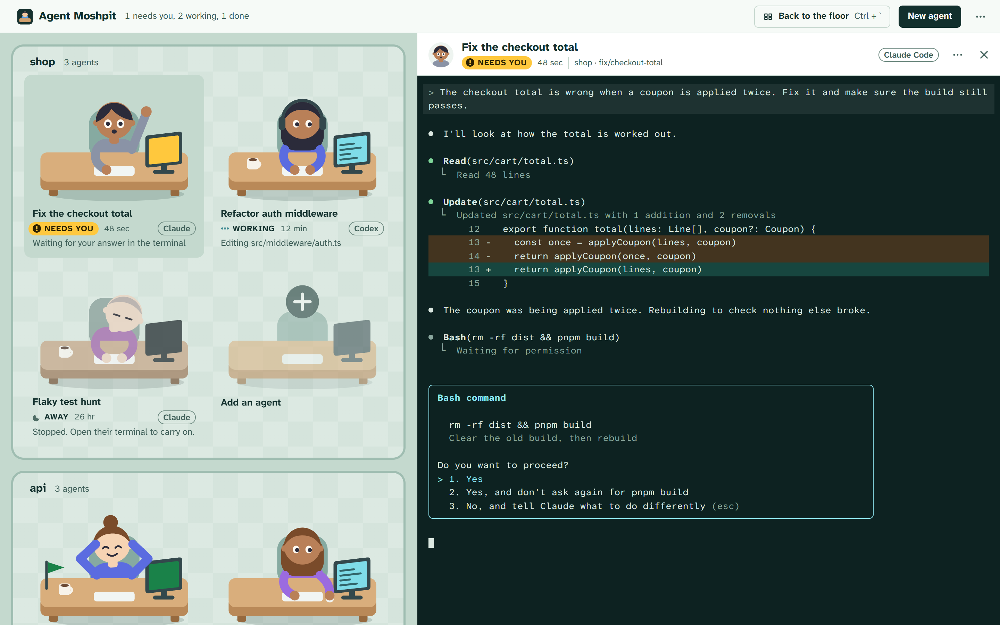
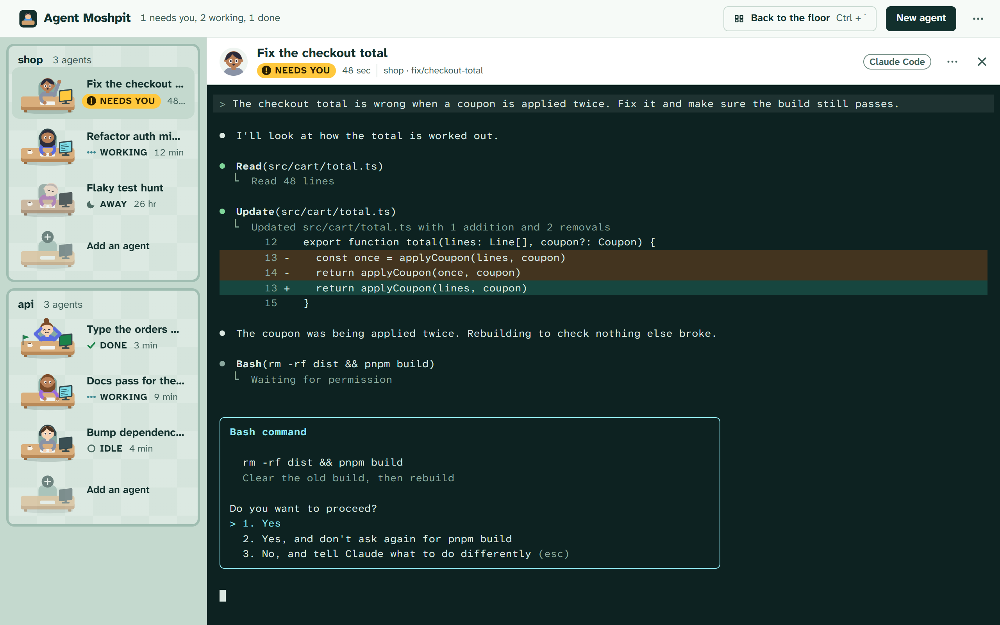
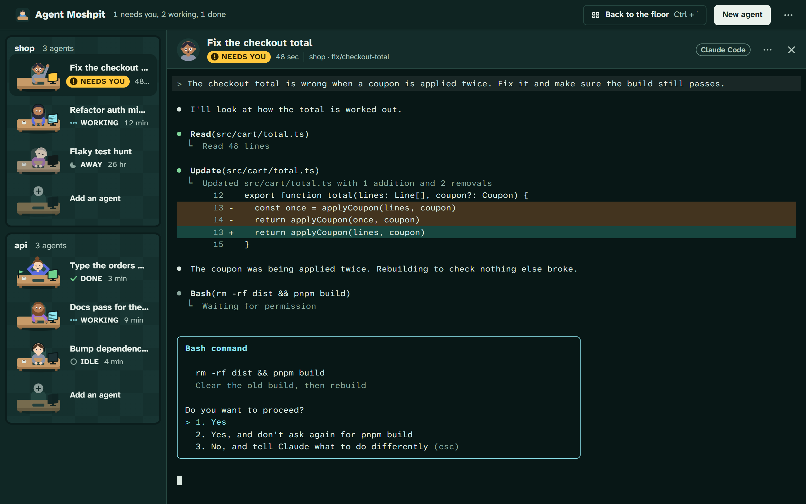
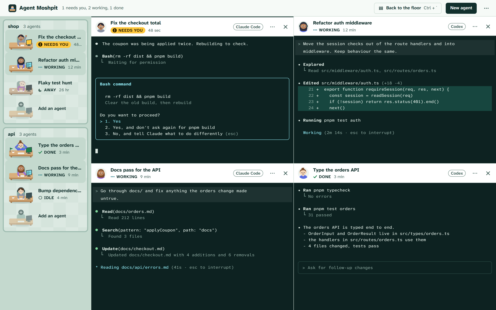
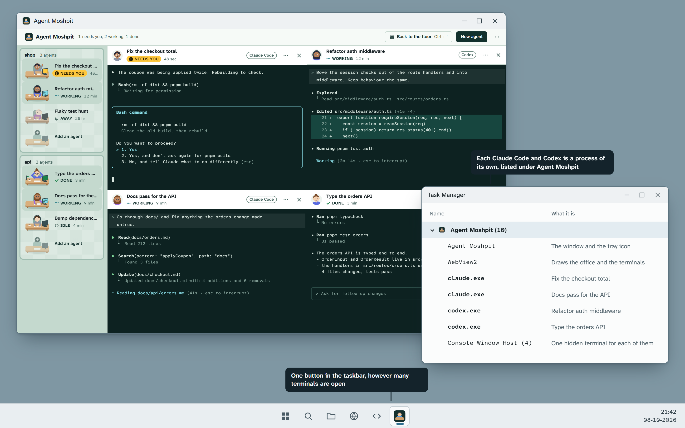
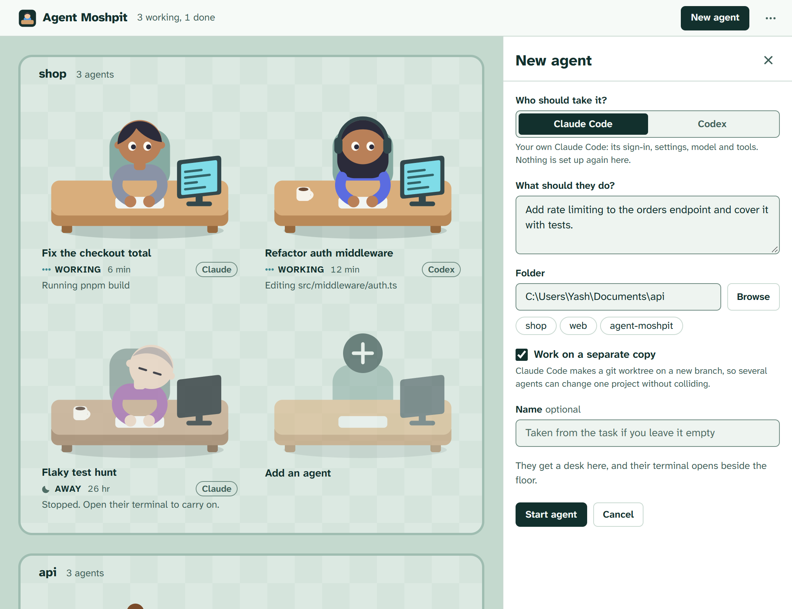
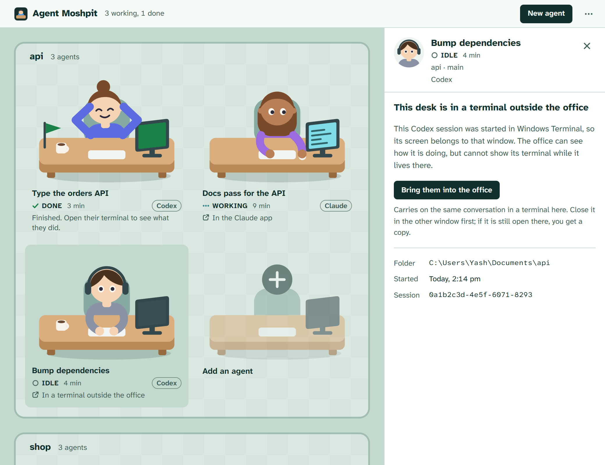

# Plan: the office over Claude Code and Codex

Written 2026-10-08. Nothing in this plan is built yet. The pictures are mockups drawn with the app's own people, furniture and colours; the terminal contents in them are typed by hand.

## What changes

Today Agent Moshpit starts Hermes, and draws each conversation itself: tool rows, diffs, a plan, a reply box. That second half is a harness of our own, and it will always be a worse one than the CLI it stands in for.

After this change the office draws no conversation at all.

- **Every worker is a real CLI.** Agent Moshpit starts Claude Code or Codex itself, as its own child process, and gives it a terminal inside the Agent Moshpit window.
- **Clicking a worker shows their terminal**, on the right of the floor. It is the program's own screen: slash commands, approvals, settings, everything.
- **Several can be open at once**, in split panes, the way BridgeMind's BridgeSpace lays out its agents.
- **Nothing is a separate window.** Windows shows one Agent Moshpit button in the taskbar. Each CLI is a process of its own in Task Manager, listed under Agent Moshpit.
- **Hermes goes.** It can come back later as a third program opened the same way.

## The mockups

### 1. The floor

- Each nameplate carries a small tag saying which program the person is. It is a word, not a colour, so the four status colours keep their meanings.
- The band no longer holds Approve and Deny. It says who is waiting and has one button, because the question is answered in their terminal.

### 2. Click a worker: their terminal opens on the right

- The floor stays an office. The open desk sits on the darker carpet.
- The edge between the floor and the terminal can be dragged.
- `Ctrl` + `` ` `` or **Back to the floor** puts the terminals away. `Esc` cannot, because both programs use it. The worker keeps working either way.
- Everything below the terminal's header is drawn by the program. The office adds nothing to it.

### 3. Drag the edge left: the floor becomes a strip

Every other worker is still one click away, so moving between terminals never goes through the floor. The terminal is dark by day and by night, like a lit screen in the room:

### 4. Several at once: split panes

- Each pane is headed by its worker: face, name, status, which program.
- The pane the keyboard goes to has a line of ink along its top.
- A worker who needs you shows it in three places at once: the raised hand on the floor, the marigold chip on the pane, and the count in the top bar.
- A plain click opens a worker in the pane you are in. `Ctrl` + click opens them in a pane of their own.

### 5. What Windows sees

This is a diagram, not a screenshot. What it claims was checked for real; see the next section.

### 6. New agent

- One new choice at the top: Claude Code or Codex.
- Starting an agent starts that CLI, seats a worker at a desk, and opens their terminal.
- The Models panel, profiles and the "ask first" switch are gone. Those belong to each program's own settings.

### 7. A desk that lives somewhere else

This is only for sessions Agent Moshpit did not start: one typed into Windows Terminal, or one inside the Claude or Codex desktop app. They appear on the floor with their status. A terminal that some other window created cannot be moved into this one, so the panel offers to carry the conversation on here instead. BridgeSpace has the same boundary: its panes are the sessions it started.

## What was checked on this machine

Claude Code 2.1.290 and Codex 0.160.0, Windows 11, 2026-10-08.

### Running the CLIs inside one app: proven

`spikes/cli-office/pty-proof/` is a small windowed program, built the way the app is, that starts Claude Code and Codex as its children, each in a pseudo-terminal (`portable-pty`, the library the app would use). `check.ps1` then asks Windows what it sees. The full output is in `result-2026-10-08-windows.txt`.

| Checked | Result |
| --- | --- |
| Both programs start and draw their real first screen | Yes: Claude Code's "do you trust this folder" screen, and Codex's `OpenAI Codex (v0.160.0)` start-up |
| Visible windows owned by any of the processes | None |
| New windows anywhere on the desktop while they ran | None |
| Where they sit in the process tree | `claude.exe`, `codex.exe` and one `conhost.exe` each, all under the one parent |
| Left behind after the parent ended them | Nothing |

Not yet checked: drawing those terminals in the window with `xterm.js`, typing into them, and resizing. Those are ordinary for this stack but have not been run here.

### Knowing who is working, idle or waiting

| Need | Claude Code | Codex | Checked how |
| --- | --- | --- | --- |
| Who is running | `claude agents --json` | app-server daemon, `thread/list` | Claude: ran it, 8 sessions listed. Codex: read from its generated protocol schema only. |
| Working, idle, needs you | `status` busy or idle; `state` blocked | `active`, `idle`, `systemError`, `notLoaded`; flags `waitingOnApproval`, `waitingOnUserInput` | Claude: seen in output. Codex: schema only. |
| Carry on a saved conversation | `claude --resume <id>` | `codex resume <id>` | Help text. |
| Separate copy of the project | `--worktree` | `--worktree` | Help text. |

Two measurements that shape the design:

- `claude agents --json` takes about 450 ms a call. It cannot be polled every second, so the office watches `~/.claude/sessions/` for changes and asks only when something moved.
- That list does not say where a session lives. For sessions the app started it already knows (it has their process id). For the rest, the per-session file beside the list says (`entrypoint`).

## How it is built

### The core (Rust)

| File | Fate | What it does |
| --- | --- | --- |
| `pty.rs` | new | Starts a CLI in a pseudo-terminal as a child of the app, streams its bytes to the window, takes keys and resizes, and keeps the last screenful so a reopened window can redraw it. |
| `harness/claude.rs` | new | The command that starts or resumes Claude Code, and its status from Claude's own session list. |
| `harness/codex.rs` | new | The same for Codex, with status from its daemon. |
| `harness/mod.rs` | new | The one shape both report in: id, program, name, folder, status, and where it lives. |
| `office.rs` | rewritten, much smaller | Turns reports into desks: stable seating, the Done flag, who is waiting longest. |
| `engine.rs` | rewritten, much smaller | One task that owns the terminals, the watchers and the timers. |
| `model.rs` | trimmed | An agent gains `harness` and `where`; loses prompt, tool bars, plan, model and profile. |
| `proctree.rs`, tray, notifications, window memory | kept | The CLIs die with the app and are never left behind. |
| `gateway.rs`, `rest.rs`, `models.rs`, `backend.rs`, `room.rs`, `terminal.rs` | deleted | All Hermes plumbing. |

### The window (Svelte)

| File | Fate |
| --- | --- |
| `Terminal.svelte` | new: a worker's header and an `xterm.js` terminal |
| `Panes.svelte` | new: one, two or four terminals, and which one has the keyboard |
| `ElsewherePanel.svelte` | new: mockup 7 |
| `Floor`, `Desk`, `Person`, `SpareDesk`, `StatusMark`, `TopBar`, `look`, `beat`, `time` | kept; `Desk` gains the tag and loses the tool bars |
| `KnockBand`, `NewAgent`, `AppMenu`, `LinkNotice`, `words`, `demo` | simplified |
| `RoomPanel`, `Models`, `PromptCard`, `ToolRow`, `ToolGroup`, `Plan`, `Rich`, `CallMark`, `ToolIcon`, `rich.ts`, `room.ts`, `providers.ts` | deleted |

About 9,000 of the 13,900 lines go. New dependencies: `portable-pty` in the core; `@xterm/xterm` and its fit and WebGL add-ons in the window.

### What happens to a worker when

| You | Their CLI |
| --- | --- |
| Go back to the floor, or open someone else | Keeps running; its terminal is only hidden |
| Close the window | Keeps running; the app stays in the tray, as it does today |
| Quit Agent Moshpit | Is ended with the app. The conversation is saved by the CLI, the desk comes back as Away, and opening it resumes |
| Put a terminal away with its ✕ | Keeps running |
| Choose Stop in a terminal's menu | Is ended; the desk stays, Away |

### How a status becomes a pose

| The program says | The office shows |
| --- | --- |
| Claude `busy`, Codex `active` | Working |
| Claude `blocked`, Codex `waitingOnApproval` or `waitingOnUserInput` | Needs you |
| Went from working to idle and the terminal has not been looked at since | Done |
| `idle` otherwise | Idle |
| Codex `systemError`, or the CLI exited with an error | Trouble |
| The CLI is not running but its conversation is saved | Away |
| Anything not recognised | Idle, and written to the log |

## Steps

Each step ends with the app building and its tests passing.

**0. Commit, then finish proving the risky parts.** Nothing is deleted in this step.
- Commit the current tree and tag it `v0.1.0-hermes`. The repository has no commits today, so without this the change cannot be undone.
- Done already: the CLIs run as children of one windowed app with no window of their own.
- Still to prove, in one bare window: a terminal drawn with `xterm.js` that you can type into, resize and paste into, with `Ctrl` + `` ` `` caught before the CLI sees it.
- Still to prove: that Claude's and Codex's status for a CLI the app started can be read as the table above assumes.

**1. One real terminal.** `pty.rs`, `Terminal.svelte`, and a New agent form that starts Claude Code. One worker, one terminal on the right. The Hermes files are deleted here.

**2. The roster.** The floor shows every worker the app started, with status from Claude's session list; desks survive a restart as Away and resume when opened.

**3. Panes.** Two and four at once, the draggable edge, the strip, moving the keyboard between panes.

**4. Codex.** The second adapter. Nothing above the adapter should need to change.

**5. Attention.** The simpler band, the tray dot, notifications that open the right terminal, the Done flag.

**6. Sessions from elsewhere.** Showing the ones the app did not start, and Bring them into the office.

**7. Words and proof.** New demo scenes; fake `claude` and `codex` programs for the end-to-end tests in place of the mock gateway; `README.md`, `PRODUCT.md` and `DESIGN.md` rewritten for what the app now is; new screenshots.

## What it will not do

- **Move a live terminal out of another window.** A session started in Windows Terminal or a desktop app is shown, and can be carried on here. Anything started from the office has no such limit.
- **Approve from the band.** Approving happens in the program's own prompt. This is the price of not being a harness, and the reason the band has one button.
- **Show diffs, plans or token counts on the floor.** Those are in the terminal.

## Open questions

1. **Should a worker outlive the app?** In this plan the CLIs are children of Agent Moshpit, so quitting it ends them (closing the window does not). Claude Code can instead run a session in its own background service (`claude --bg`, `claude attach`), which would survive a quit. That path is not yet proven inside an embedded terminal and Codex's equivalent is marked experimental, so the plan leaves it for later.
2. **What the third line of a desk says while working.** The lists give a status, not "Editing src/auth.ts". That line can be read from each session's transcript file, which is extra work and reads a file neither program promises to keep stable. The mockups show it; until it is built the line says only "Working".
3. **Desktop-app sessions on the floor.** The plan shows them, marked. The alternative is a switch in the menu that hides them.
4. **macOS and Linux** stay as they are today: written for, not yet run.
